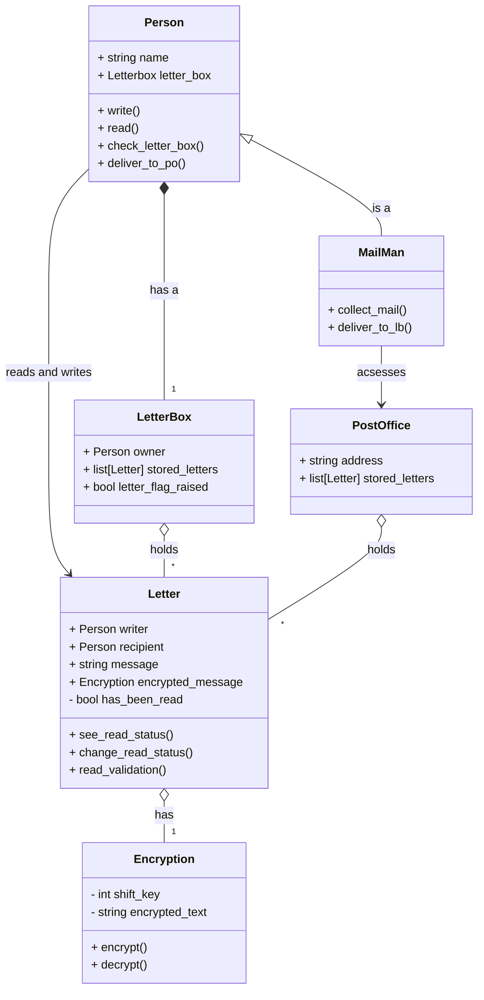
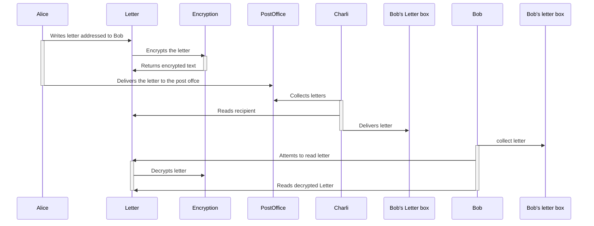
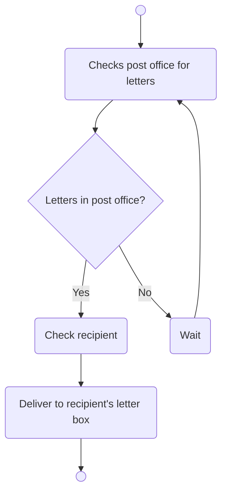
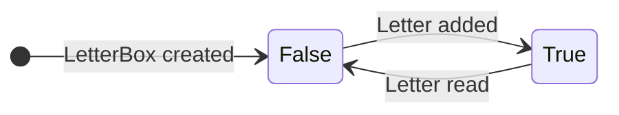

```mermaid
classDiagram
   Person <|-- MailMan: is a
   Person *-- "1"  LetterBox :has a
   Person --> Letter: reads and writes
   Letter o-- "1" Encryption: has
   MailMan --> PostOffice: acsesses
   LetterBox o-- "*" Letter: holds
   PostOffice o-- "*" Letter: holds
   
   class Person {
    + string name
    + Letterbox letter_box
    + write()
    + read()
    + check_letter_box()
    + deliver_to_po() 
    }
   class MailMan {
    + collect_mail()
    + deliver_to_lb()
    }
   class LetterBox {
    + Person owner
    + list[Letter] stored_letters
    + bool letter_flag_raised
    }
   class Letter {
    + Person writer
    + Person recipient
    + string message
    + Encryption encrypted_message
    - bool has_been_read
    + see_read_status()
    + change_read_status()
    + read_validation()
    }
   class Encryption {
    - int shift_key
    - string encrypted_text
    + encrypt()
    + decrypt()
    }
   class PostOffice {
    + string address
    + list[Letter] stored_letters
    }    
```

``` mermaid
sequenceDiagram
Alice->>Letter: Writes letter addressed to Bob
activate Alice
Letter->>Encryption: Encrypts the letter
activate Encryption
Encryption->>Letter: Returns encrypted text
deactivate Encryption
Alice->>PostOffice: Delivers the letter to the post offce
deactivate Alice
Charli->>PostOffice: Collects letters
activate Charli
Charli->>Letter: Reads recipient
Charli->>Bob's Letter box: Delivers letter
deactivate Charli
Bob->>Bob's letter box:collect letter
activate Bob
Bob->>Letter:Attemts to read letter
activate Letter
Letter->>Encryption: Decrypts letter
Bob->>Letter: Reads decrypted Letter
deactivate Bob
deactivate Letter

```

```mermaid
flowchart TB
id1(( )) --> 
id2(Checks post office for letters) -->
id3{Letters in post office?} -->|Yes|id4(Check recipient) --> id7(Deliver to recipient's letter box)
id3 -->|No|id5(Wait) --> id2
id7 --> id8(( ))
```

```mermaid
stateDiagram

direction LR
[*] --> False: LetterBox created 
False --> True: Letter added
True --> False: Letter read
```
